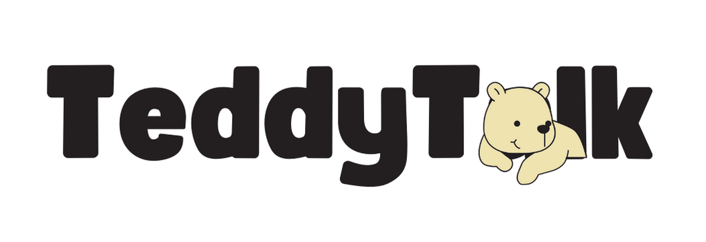
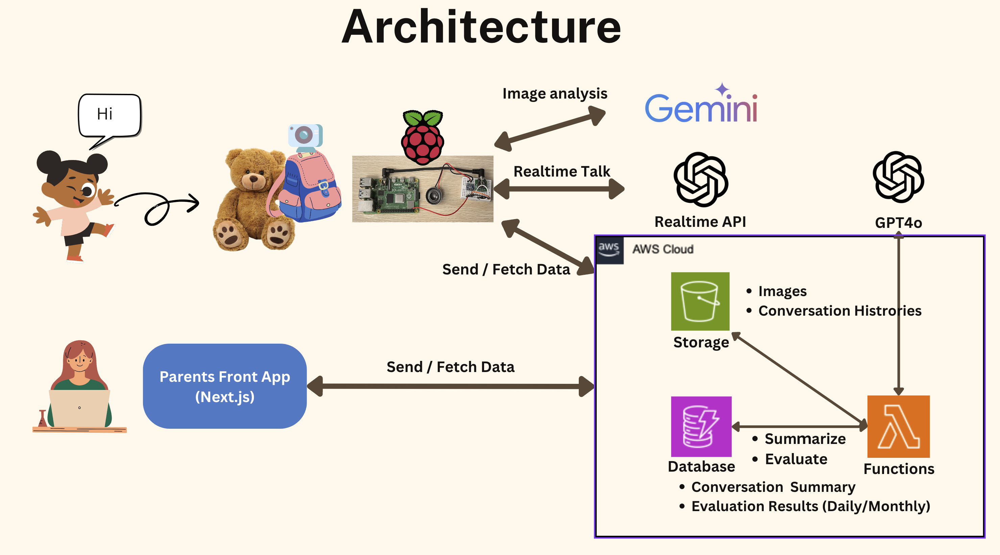
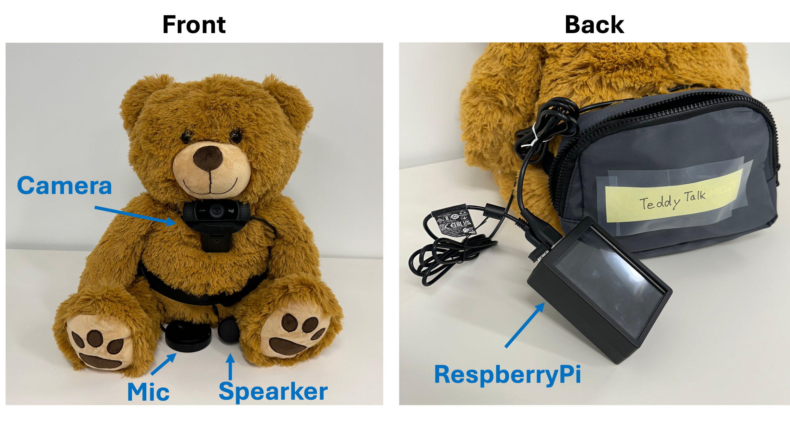

# Teddy Talk
Teddy Talk is an innovative AI chatbot system that encourages children to learn and grow through engaging conversations with a teddy bear.

## Project Overview

This project consists of two main components:

1. **Kids App**: An interactive interface for children to chat with an AI-powered teddy bear.
2. **Parent App**: A dashboard for parents to monitor their child's activities and track developmental progress.
3. **Infrastructure**: Utilizes AWS IoT Core, DynamoDB, and S3 for storing conversation history.

## Architecture


## Device


## Prerequisites

- Node.js (recommended version 14 or later)
- npm or yarn
- An AWS account with access to S3 and DynamoDB services

## Installation

1. Clone the repository:
   ```
   git clone https://github.com/your-username/teddy-talk.git
   cd teddy-talk
   ```

2. Install dependencies for both apps:
   ```
   cd kids-app && npm install
   cd ../parent-app && npm install
   ```

## Running the Applications

### Kids App

```
cd kids-app
npm start
```

The app will be available at `http://localhost:3000`.

### Parent App

```
cd parent-app
npm run dev
```

The app will be available at `http://localhost:3000`.

## Features

### Kids App
- Interactive AI assistant (TeddyTalk) for educational conversations
- Voice interaction with manual and Voice Activity Detection (VAD) modes
- Image capture and analysis
- S3 storage for conversation history

### Parent App
- Dashboard for monitoring child's activities
- Daily and monthly summaries of interactions
- Development tracking across various domains (cognitive, social, etc.)
- Data visualization with charts and graphs

## Security Notes

- Ensure AWS credentials have the necessary permissions for S3 and DynamoDB operations.
- Never commit `.env` files to version control.
- Configure appropriate security settings for S3 buckets and DynamoDB tables.

## Contributing

Please read [CONTRIBUTING.md](CONTRIBUTING.md) for details on our code of conduct and the process for submitting pull requests.

## License

This project is licensed under the MIT License - see the [LICENSE](LICENSE) file for details.
